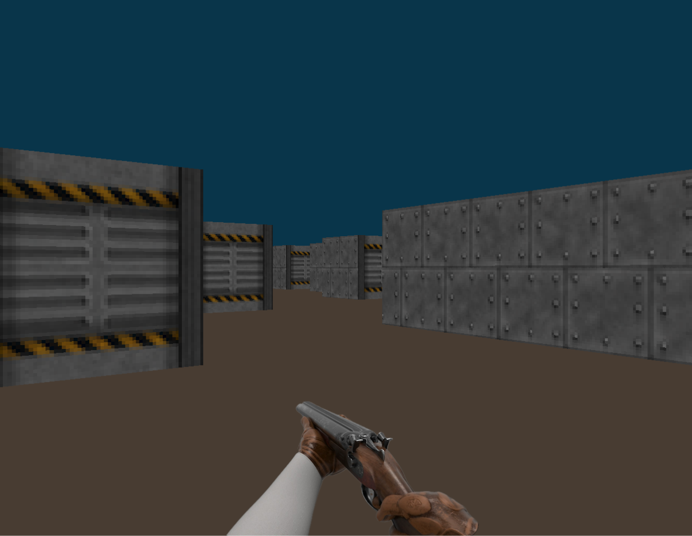
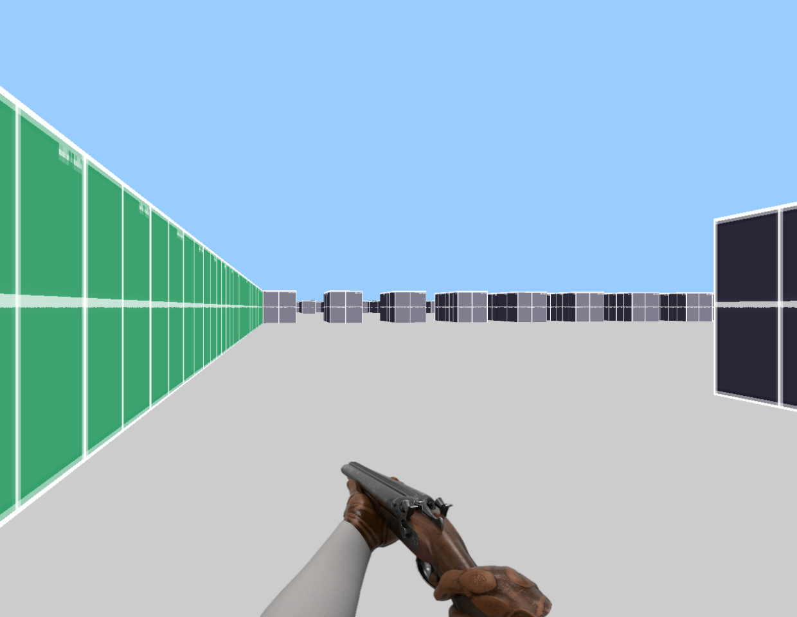

# Cub3D

* [Overview](#overview)
* [How To Play](#play)
  * [Move](#move)
  * [Turn](#turn)
  * [Execution](#execution)
  * [Pipes & Redirection](#pipes-and-redirections)
  * [Signals](#signals)
  * [Memory & Error management](#memory-management--error-handling)
* [Possible Improvements](#possible-improvements)
* [Useful Resources](#useful-resources)
* [Contributors](#contributors)

## Overview
Cub3D is a team project where we created a 3D-looking 2D game using a technique called raycasting. Raycasting is a rendering method also used in the classic FPS game Wolfenstein 3D.

The project consists of two main parts: parsing and processing the map from a file provided as an argument, and rendering the game according to the parsed map and its information.

This project has been archived in the state it was in at the time of evaluation.

## Play
The program takes a map file as an argument. Valid and invalid maps can be found in the maps directory. Maps in the invalid directory won't work due to incorrectly formatted map files.
* To make and/or clean the program use: `make` `make clean` `make fclean` `make re`
* To run: ./cub3D maps/<some_map.cub>
* Exit game: ESC & close window button (x)
### Move
W: forward
S: backward
A: left
D: right
### Turn
left arrow: left
right arrow: right

## Useful Resources
* Raycasting: Permadi's Raycasting tutorial
* Minilibx: hsmits MiniLibX documentation
* Minilibx: gontjarow's MiniLibX tutorial

## Contributors
* [eleppala](https://github.com/eleppala)
* [asalo](https://github.com/enduserrr)

